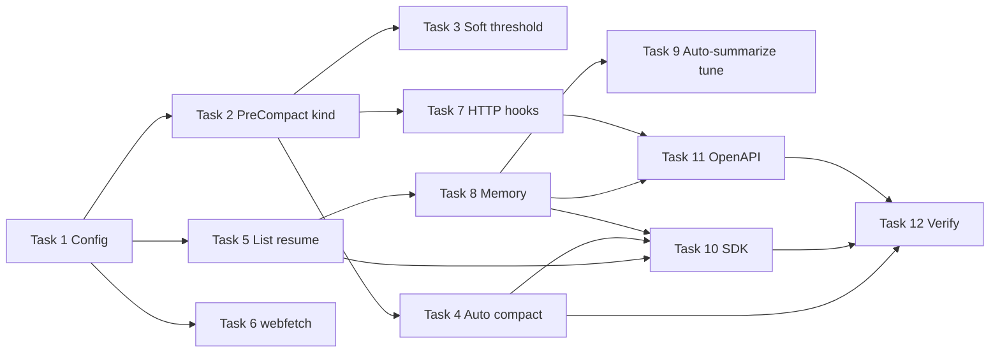

# Phase 1.5 Remainder Implementation Plan

> **For agentic workers:** REQUIRED SUB-SKILL: Use superpowers:subagent-driven-development (recommended) or superpowers:executing-plans to implement this plan task-by-task. Steps use checkbox (`- [ ]`) syntax for tracking.
>
> **Commits:** Do not `git commit` unless Jayant explicitly asks. Commit steps below are checkpoints only.
>
> **Prerequisite:** [2026-09-16-phase-1.5-skills-harness.md](./2026-09-16-phase-1.5-skills-harness.md) — skills catalog, activation, HTTP/SDK, SQLite `activeSkills`, TUI, `InstructionsLoaded`, `zox.skills.active`.

**Goal:** Close remaining `spec/phases.md` Phase 1.5 (“Agents and quality”) items that are not the skills harness: auto-compaction, soft `PreCompact` + `SessionStart(compact)` reinjection, session list/resume, `webfetch`, durable memory, SDK helpers + e2e, OpenAPI contract tests. Also land `http` hook handlers from [hooks.md](../../../spec/hooks.md) (Phase 1.5 handler type; not listed in the phases.md checklist).

**Architecture:** SQLite `sessions` remain episodic source of truth; add `SessionStore.list` and resume without re-running `skills.autoLoad`. Compaction stays in `@zox/core` (`compactSessionTurn`); the loop yields `context.overflow` then runs auto-compact before the model round. Soft threshold only runs the hook-only prior-state path (no message-range compact). Durable memory is markdown under `.zox/memory/` plus FTS in the workspace DB (`@zox/memory`). `webfetch` is a `build`-agent builtin with ask-by-default permissions and SSRF guards. SDK talks HTTP only.

**Tech Stack:** Bun workspaces, Zod (`@zox/contracts`), Hono, `bun:sqlite` + FTS5, Ink TUI, existing command hook runner plus `type: "http"`.

## Already landed (do not reimplement)

| Spec item | Where it lives |
|-----------|----------------|
| Manual `/compact` + SDK `session.compact()` | `packages/server/src/app.ts` `runCompact` |
| `PreCompact` / `PostCompact` / `SessionStart` matcher `compact` on **full** compact | `packages/core/src/compact.ts` (matcher `auto\|manual` still missing) |
| Prior-state prefix in provider assembly | `packages/context/src/assemble.ts` `priorStateMarkdown` |
| Active skill names in compaction summarizer prompt | skills harness (`compact.ts` `activeSkillNames`) |
| `context.overflow` event (no auto-compact yet) | `packages/core/src/loop.ts` `emitContextWarnings` |
| `OVERFLOW_THRESHOLD` 0.85 known window; 0.75 if window unknown | `loop.ts` |
| `GET /sessions/:id/memory` (plan + prior-state + activeSkills) | `app.ts` — extend with injected durable ids |
| SessionEnd auto-summarize → `.zox/memory/auto/` | `packages/memory/src/summarize.ts` |
| SDK `respondPermission` | `packages/sdk/src/client.ts` |
| `GET /hooks` (commands redacted to paths) | `app.ts` |
| Skills persist/restore on `SqliteSessionStore.get` | session schema v3 |

## Global Constraints

- Runtime: Bun only (`bun install`, `bun run`, `bun test`).
- `cli` and `sdk` depend on `contracts` + HTTP; they do not import `core`.
- Style: `createX` factories, `bun:test`, `.ts` import extensions, Zod in contracts, no `any`.
- Do not break Phase 0/1 or skills harness tests. Extend them.
- **Hard overflow** ([context.md](../../../spec/context.md)): `estimated > windowTokens * context.overflowThreshold` (default **0.85**; unknown window keeps **0.75 × 128_000**). Yield `context.overflow`, then **auto** `compactSessionTurn({ kind: "auto" })`, then continue the same turn (keep the new user message). SQLite retains full history; only provider assembly shrinks.
- **Soft threshold** ([memory.md](../../../spec/memory.md) / [hooks.md](../../../spec/hooks.md)): `estimated >= budget.preCompactTokenThreshold` (default **150_000**) **and** hard overflow is **not** also true. Hook-only path: `PreCompact` matcher `auto`, then `SessionStart` matcher `compact` to merge `message` into `priorStateMarkdown`. No compaction range, no summarizer. Run at most **once per crossing** until a full compact succeeds (then the flag resets). If hard overflow fires in the same estimate, skip the soft-only path — full compact already runs `PreCompact` + `SessionStart(compact)`.
- Compaction **kind** is `payload.matcher` (`"auto"` | `"manual"`). `createHookRunner.run(event, payload)` already uses `matchValueFrom(input.matcher)`. Do not add a third `run()` argument.
- Manual `/compact` and SDK `compact()` use `kind: "manual"`. Auto overflow uses `kind: "auto"`.
- Compaction failure: yield `error` (`code: "context.compact_failed"`); do not call the model on a half-compacted session.
- Resume: `store.get` hydrates messages, `planJson`, `priorStateMarkdown`, `compactions`, `activeSkills`. **Do not** call `loadAutoSkills` on resume. Fire `SessionStart` matcher `resume` once per process attachment.
- `webfetch`: **build** agent only; **plan** must not list it. Default permission **ask** (sandbox tier 0–1). Not path-jailed. Block loopback / private / link-local URLs (SSRF separate from `ZOXX_ALLOW_REMOTE_PROVIDERS`). Truncate with `sandbox.maxToolOutputChars` (32_000).
- Durable memory: files under `.zox/memory/` **and** FTS table `memories`. Pins (`/remember`) rank above other hits. No embeddings (V2).
- **Out of scope:** prune / protected skill-tool prune ([phases.md](../../../spec/phases.md) Phase 2); `task` / `question` / `apply_patch` (tools-extensibility says V1.5; **phases.md Phase 2 wins** for `task`); keychain ([providers.md](../../../spec/providers.md)); plugin hook type (V2); `budget.maxTurns` / `budget.exceeded` (observability cost-control, not in Phase 1.5 Other list).

---

## File structure

| Path | Responsibility |
|------|----------------|
| `packages/config/src/schema.ts` | `context.overflowThreshold`, `budget.preCompactTokenThreshold`, `memory.*` extras, `tools.webfetch` |
| `packages/contracts/src/session.ts` | Session list DTO (extend existing file; do not add `sessions.ts`) |
| `packages/contracts/src/memory.ts` | Memory write/search DTOs |
| `packages/core/src/loop.ts` | Soft/hard gates; `onOverflow` / compact-then-continue |
| `packages/core/src/compact.ts` | `kind: "manual" \| "auto"`; pass `matcher` on PreCompact |
| `packages/core/src/agents.ts` | Add `webfetch` to **build** tools; default **ask** |
| `packages/context/src/assemble.ts` | Order: systemNotes → prior-state → catalog → skill bodies → history ([context.md](../../../spec/context.md) items 3–4 + skills harness) |
| `packages/session/src/schema.ts` | v4 `memories` + FTS5; expose `created_at` on list |
| `packages/session/src/sqlite.ts` | `list({ workspaceRoot, limit })` |
| `packages/memory/src/durable.ts` | Pins, FTS, startup inject, user-scope files |
| `packages/memory/src/summarize.ts` | Prior-state + rolling summary |
| `packages/tools/src/webfetch.ts` | HTTP GET, SSRF, size cap |
| `packages/tools/src/memory_write.ts` | Ask-gated fact write |
| `packages/tools/src/memory_search.ts` | FTS; pins first |
| `packages/hooks/src/runner.ts` | `type: "http"` |
| `packages/server/src/app.ts` | Auto-compact, list/resume, memory routes, `/remember` |
| `packages/server/openapi/openapi.yaml` | New paths |
| `packages/sdk/src/client.ts` | `sessions.list` / `get`; send helpers |
| `examples/hooks/prior-state-summary.sh` | Capstone PreCompact example |
| `examples/hooks/reinject-after-compact.sh` | Capstone SessionStart `compact` example |

---

### Task 1: Config — context, budget, memory, webfetch

**Files:**
- Modify: `packages/config/src/schema.ts`
- Modify: `packages/config/src/load.test.ts`

**Interfaces:** extend existing `memory` object (already has `autoSummarize`). Runtime defaults stay in core/server: overflow **0.85**, preCompact **150_000**, `webfetch.maxBytes` **32_000** (same as `sandbox.maxToolOutputChars`).

```ts
context: z
  .object({
    overflowThreshold: z.number().gt(0).lte(1).optional(),
  })
  .optional(),
budget: z
  .object({
    preCompactTokenThreshold: z.number().int().positive().optional(),
  })
  .optional(),
// merge into existing memory:
summarizeModel: z.string().optional(),
startupInjectCount: z.number().int().positive().optional(),
rollingSummary: z.boolean().optional(),
autoInject: z.array(z.string()).optional(),
tools: z
  .object({
    webfetch: z
      .object({
        maxBytes: z.number().int().positive().optional(),
        allowedHosts: z.array(z.string()).optional(),
      })
      .optional(),
  })
  .optional(),
```

- [ ] **Step 1: Write the failing parse test** in `packages/config/src/load.test.ts`:

```ts
test("parses Phase 1.5 context, budget, memory, and webfetch fields", () => {
  const parsed = zoxConfigSchema.parse({
    context: { overflowThreshold: 0.9 },
    budget: { preCompactTokenThreshold: 120000 },
    memory: {
      autoSummarize: true,
      summarizeModel: "mock/echo",
      startupInjectCount: 5,
      rollingSummary: true,
      autoInject: ["preferences.md"],
    },
    tools: { webfetch: { maxBytes: 32000, allowedHosts: ["example.com"] } },
  });
  expect(parsed.budget?.preCompactTokenThreshold).toBe(120000);
  expect(parsed.tools?.webfetch?.allowedHosts).toEqual(["example.com"]);
});
```

- [ ] **Step 2:** `bun test packages/config/src/load.test.ts` — FAIL (unknown keys / missing schema).

- [ ] **Step 3:** Add the fields to `zoxConfigSchema`.

- [ ] **Step 4:** `bun test packages/config` — PASS.

---

### Task 2: PreCompact `auto|manual` matcher + assemble order

**Files:**
- Modify: `packages/core/src/compact.ts`
- Modify: `packages/core/src/compact.test.ts`
- Modify: `packages/context/src/assemble.ts`
- Modify: `packages/context/src/compact.test.ts` (assemble tests)
- Modify: `packages/server/src/app.ts` (`runCompact(session, kind)`)

**Interfaces:**

```ts
export async function* compactSessionTurn(opts: {
  session: StoredSession;
  summarize: SessionSummarizer;
  hooks?: HookRunner;
  kind?: "manual" | "auto";
  estimatedTokens?: number;
}): AsyncIterable<ZoxEvent>;
```

Pass `matcher: opts.kind ?? "manual"` on both `PreCompact` and (unchanged) `SessionStart` compact payload. Keep existing `SessionStart({ matcher: "compact" })` after successful compact.

- [ ] **Step 1: Write failing tests**

`packages/core/src/compact.test.ts` — two scripts; `matcher: "manual"` must not run when `kind: "auto"`:

```ts
test("PreCompact matcher auto|manual is honored", async () => {
  const root = await mkdtemp(join(tmpdir(), "zox-precompact-"));
  const autoFile = join(root, "auto.ran");
  const manualFile = join(root, "manual.ran");
  const autoHook = join(root, "auto.sh");
  const manualHook = join(root, "manual.sh");
  await Bun.write(autoHook, `#!/bin/sh\ntouch "${autoFile}"\nprintf '{"decision":"allow"}\\n'`);
  await Bun.write(manualHook, `#!/bin/sh\ntouch "${manualFile}"\nprintf '{"decision":"allow"}\\n'`);
  await chmod(autoHook, 0o755);
  await chmod(manualHook, 0o755);
  const hooks = createHookRunner({
    files: [{
      zoxHooksVersion: 1,
      hooks: {
        PreCompact: [
          { matcher: "auto", type: "command", command: autoHook },
          { matcher: "manual", type: "command", command: manualHook },
        ],
      },
    }],
    trusted: true,
    cwd: root,
  });
  const sess = session([
    { id: "m1", role: "user", content: "a" },
    { id: "m2", role: "assistant", content: "b" },
    { id: "m3", role: "user", content: "c" },
    { id: "m4", role: "user", content: "last" },
  ]);
  for await (const _ of compactSessionTurn({
    session: sess,
    summarize: async () => "SUM",
    hooks,
    kind: "auto",
  })) { /* drain */ }
  expect(existsSync(autoFile)).toBe(true);
  expect(existsSync(manualFile)).toBe(false);
});
```

Assemble test: `systemNotes` appear **before** `priorStateMarkdown` in the prefix list.

- [ ] **Step 2:** `bun test packages/core/src/compact.test.ts packages/context/src/compact.test.ts` — FAIL.

- [ ] **Step 3:** Implement `kind` default `"manual"`; PreCompact payload `{ session, matcher: kind, context: { estimatedTokens } }`. Reorder assemble prefixes: `systemNotes`, `priorStateMarkdown`, `skillsCatalog`, `skillBodies`, history.

- [ ] **Step 4:** `runCompact` takes `kind`; `recordCompaction(kind)`; slash/SDK stay `"manual"`.

- [ ] **Step 5:** Tests PASS.

---

### Task 3: Soft `preCompactTokenThreshold` (hook-only prior-state)

**Files:**
- Create: `packages/core/src/soft-compact.ts`
- Create: `packages/core/src/soft-compact.test.ts`
- Modify: `packages/core/src/store.ts` — `softPreCompactPending?: boolean` (in-memory; persist optional, default **do not persist**)
- Modify: `packages/core/src/loop.ts` — after estimate, before model round
- Modify: `packages/server/src/app.ts` — pass `preCompactTokenThreshold` into `runTurn`

**Interfaces:**

```ts
export async function runSoftPreCompact(opts: {
  session: StoredSession;
  hooks?: HookRunner;
  estimatedTokens: number;
}): Promise<void>;
```

Behavior ([hooks.md](../../../spec/hooks.md) compaction path, hook-only branch):

1. `PreCompact` with `matcher: "auto"`.
2. If hook `message` is non-empty, append to `session.priorStateMarkdown`.
3. `SessionStart` with `matcher: "compact"`; append that `message` too (same merge as `compact.ts`).
4. Do **not** push `compactions`, do **not** call `summarize`, do **not** emit `context.compacted`.

Loop gate: `estimated >= threshold && !hardOverflow && !session.softPreCompactPending`. Set the flag true after a successful soft run; clear it in `compactSessionTurn` after a full compact.

- [ ] **Step 1: Failing test** — messages length unchanged; `priorStateMarkdown` contains hook text; no `compactions` entry.

- [ ] **Step 2:** `bun test packages/core/src/soft-compact.test.ts` — FAIL.

- [ ] **Step 3:** Implement helper + loop wiring (`runTurn` opts `preCompactTokenThreshold?: number`, default 150_000).

- [ ] **Step 4:** `bun test packages/core` — PASS.

- [ ] **Step 5:** Add `examples/hooks/prior-state-summary.sh` and `examples/hooks/reinject-after-compact.sh` (capstone examples 3 and 4). Scripts print JSON `decision: allow` and a `message` markdown prior-state stub; they do not call a model.

---

### Task 4: Auto-compaction on hard overflow

**Files:**
- Modify: `packages/core/src/loop.ts`
- Modify: `packages/core/src/loop.test.ts`
- Modify: `packages/server/src/app.ts`

**Behavior:** After `emitContextWarnings`, if overflow:

1. Keep yielding `context.overflow` (already there).
2. Call `opts.onOverflow?.({ kind: "auto", estimatedTokens })`. Server implementation: `for await (const e of compactSessionTurn({ session, summarize, hooks, kind: "auto" })) bus.publish(...)` then `recordCompaction("auto")` and `store.save`.
3. At most **one** auto compact per user turn (do not loop 2+ times). If estimate still overflows, still proceed (manual `/compact` remains available); do not drop the user message.
4. If compact throws / summarizer rejects, yield `error` with `code: "context.compact_failed"` and set `session.status = "idle"` (or `"error"` consistent with other loop failures).

`runTurn` new opt:

```ts
onOverflow?: (info: {
  kind: "auto";
  estimatedTokens: number;
}) => Promise<void> | AsyncIterable<ZoxEvent>;
```

Prefer `AsyncIterable<ZoxEvent>` so compact SSE events (`session.status` compacting, `context.compacted`) reach the client during the turn. If the callback returns an iterable, `yield*` it.

Pass `overflowThreshold` from config into `emitContextWarnings` (replace hardcoded `KNOWN_OVERFLOW_RATIO` when provided).

- [ ] **Step 1: Loop test** — `context.windowTokens: 100`, messages whose estimate is `> 85`, `onOverflow` called once; after callback pushes a compaction, model `streamChat` still runs.

- [ ] **Step 2: Server test** — long history + mock adapter; first provider payload after overflow includes a summary system/assistant compact message and not the full skipped range (reuse assemble skip behavior).

- [ ] **Step 3:** Implement.

- [ ] **Step 4:** `bun test packages/core packages/server/src/app.test.ts` — PASS.

---

### Task 5: Session list + resume

**Files:**
- Modify: `packages/core/src/store.ts` — `list`, optional `createdAt` on `StoredSession`
- Modify: `packages/session/src/sqlite.ts` — SELECT `created_at`; `list`
- Modify: `packages/core/src/store.ts` `MemorySessionStore`
- Modify: `packages/contracts/src/session.ts` + `session.test.ts`
- Modify: `packages/server/openapi/openapi.yaml` — `GET /sessions`
- Modify: `packages/server/src/openapi-stub.test.ts`
- Modify: `packages/server/src/app.ts`
- Modify: `packages/sdk/src/client.ts` + `client.test.ts`
- Modify: `packages/cli/src/parse.ts` + `embed.ts` — `--session <id>`

**Interfaces:** add to existing `packages/contracts/src/session.ts`:

```ts
export const sessionSummarySchema = z.object({
  id: z.string(),
  workspaceRoot: z.string(),
  agent: z.string(),
  model: z.string(),
  status: sessionStatusSchema,
  createdAt: z.number(),
});
export const sessionListResponseSchema = z.object({
  sessions: z.array(sessionSummarySchema),
});
```

HTTP:

- `GET /sessions?workspaceRoot=&limit=50` → `{ sessions }` ordered `created_at DESC`. 400 if `workspaceRoot` missing.
- `GET /sessions/:id` already restores the SQLite row (including `activeSkills`).

Resume path in `createApp`:

- `client.sessions.get(id)` is HTTP GET + session handle (no create).
- On first `POST /sessions/:id/messages` (or GET-after-attach) if `id` not in `resumedSessions: Set<string>`: `ensureWorktree` using stored `sandboxRoot` if the directory still exists, else recreate; run `SessionStart` matcher **`resume`**; merge hook `message` into `systemNotes`; **do not** `loadAutoSkills`.
- Creating a **new** session still uses matcher `startup` + `loadAutoSkills` (unchanged).

CLI: `--session <id>` calls `client.sessions.get` instead of `create`.

- [ ] **Step 1:** SQLite test — two sessions same `workspaceRoot`, `list` returns both ids newest first; `createdAt` is a number.

- [ ] **Step 2:** HTTP test — create, new `createApp` with the same sqlite file, `GET /sessions/:id` has messages; `GET /sessions?workspaceRoot=` lists the id; POST message fires resume hook (file touch), does not duplicate autoLoad skills.

- [ ] **Step 3:** SDK — `sessions.list` + `sessions.get(id)` then `send`.

- [ ] **Step 4:** Implement.

- [ ] **Step 5:** `bun test packages/session packages/server/src/app.test.ts packages/sdk/src/client.test.ts packages/contracts` — PASS.

---

### Task 6: `webfetch` tool

**Files:**
- Create: `packages/tools/src/webfetch.ts`
- Create: `packages/tools/src/webfetch.test.ts`
- Create: `packages/tools/src/descriptions/webfetch.txt`
- Modify: `packages/tools/src/builtins.ts` + `index.ts`
- Modify: `packages/core/src/agents.ts` — `BUILD_TOOLS` includes `webfetch`; `plan` does not; `PROFILES.build.ruleset.webfetch = { default: "ask" }`
- Modify: `packages/core/src/agents.test.ts` if present
- Pass `allowedHosts` / `maxBytes` via `ToolContext` (extend types like `loadPaths`)

**Interfaces:**

```ts
// execute args: { url: string }
// GET only. Reject: 127.0.0.0/8, ::1, localhost, 10/8, 172.16/12, 192.168/8, 169.254/16, 0.0.0.0
// If allowedHosts set, hostname must match exactly or as suffix "example.com"
// Body cap: ctx.webfetchMaxBytes ?? 32_000; also respect ctx.maxToolOutputChars
```

- [ ] **Step 1: Tests** — reject `http://127.0.0.1/x`; reject host not in allowlist; truncate oversize body; `fetch` injected/stubbed for a 200 text/html response.

- [ ] **Step 2:** `bun test packages/tools/src/webfetch.test.ts` — FAIL.

- [ ] **Step 3:** Implement; register in `createBuiltinTools`; loop already permission-asks unknown-default tools — set ask on build profile.

- [ ] **Step 4:** `bun test packages/tools packages/core/src/agents.ts` (or agents tests) — PASS.

---

### Task 7: HTTP hook handlers

**Files:**
- Modify: `packages/hooks/src/types.ts` — `HookEntry.type: "command" | "http"`; `url?: string`; `headers?: Record<string, string>`
- Modify: `packages/hooks/src/runner.ts` — parse `http` entries; POST JSON `HookInput`; parse JSON `HookOutput`; timeout `timeoutMs`
- Create: `packages/hooks/src/http.test.ts`
- Modify: `packages/server/src/app.ts` — `POST /sessions/:id/hooks/test`
- Modify: `packages/server/openapi/openapi.yaml`

Keep `zoxHooksVersion: 1`. Command entries unchanged (`type: "command"` required as today).

`POST /sessions/{id}/hooks/test` ([hooks.md](../../../spec/hooks.md) SDK/server API): body `{ event, payload }`; runs runner; returns `HookOutput`. 404 unknown session.

- [ ] **Step 1: Test** — mock `globalThis.fetch` returning `{ decision: "deny", reason: "nope" }`; PreToolUse http hook denies.

- [ ] **Step 2:** Network error with `onError: "warn"` → allow and continue.

- [ ] **Step 3:** Implement runner + dry-run route.

- [ ] **Step 4:** `bun test packages/hooks packages/server/src/app.test.ts` — PASS.

---

### Task 8: Durable memory — FTS, APIs, `/remember`, tools

**Files:**
- Modify: `packages/session/src/schema.ts` — SCHEMA_VERSION **4**:

```sql
CREATE TABLE IF NOT EXISTS memories (
  id TEXT PRIMARY KEY,
  scope TEXT NOT NULL,
  tags TEXT,
  content TEXT NOT NULL,
  pinned INTEGER NOT NULL DEFAULT 0,
  path TEXT,
  updated_at INTEGER NOT NULL
);
CREATE VIRTUAL TABLE IF NOT EXISTS memories_fts USING fts5(
  content,
  content='memories',
  content_rowid='rowid'
);
```

Add insert/delete/update triggers so FTS stays in sync (standard FTS5 `content=` pattern).

- Create: `packages/memory/src/durable.ts` + `durable.test.ts`
- Create: `packages/contracts/src/memory.ts` + test; export from `index.ts`
- Modify: OpenAPI: `GET /memory/search`, `POST /sessions/{id}/memory`
- Modify: `packages/server/src/app.ts`
- Create: `packages/tools/src/memory_write.ts`, `memory_search.ts`, descriptions
- Modify: `packages/tools/src/builtins.ts` — both tools on **all** agents (`read`-like); `memory_write` permission **ask**, `memory_search` **allow**
- Modify: `COMMAND_NAMES`, `packages/cli/src/parse.ts` `SLASH_NAMES`, `packages/tui/src/slash.ts` — add `"remember"` after `"trace"`

**Write paths** ([memory.md](../../../spec/memory.md)):

| Mechanism | Behavior |
|-----------|----------|
| `/remember <text>` | Pin: `scope: "project"`, `pinned: 1`; append `.zox/memory/project-facts.md` (or `pins.md`) **and** FTS row |
| `POST /sessions/:id/memory` `{ content, pinned?: boolean }` | Same as remember when `pinned: true`; else unpinned fact |
| `memory_write` tool `{ content }` | Unpinned project fact; permission ask |

**Read paths:**

| Mechanism | Behavior |
|-----------|----------|
| `GET /memory/search?q=&workspaceRoot=` | FTS; `ORDER BY pinned DESC, rank` |
| `memory_search` tool `{ query }` | Same ranking |
| Session **create** `startup` | After existing SessionStart: `loadStartupMemories` — top `startupInjectCount` (default 5) + files in `memory.autoInject[]` (workspace `.zox/memory/<name>` and `~/.config/zox/memory/<name>`) pushed to `systemNotes` |
| `GET /sessions/:id/memory` | Add `injectedDurableIds: string[]` (ids injected this session) |

User-scope files live in `~/.config/zox/memory/`. Index them into FTS with `scope: "user"` on write from `/remember` only if a future flag is set — **this slice:** `/remember` is project scope. Startup `autoInject` still reads user-dir files by basename.

Do not add `embedding` columns.

- [ ] **Step 1:** `durable.test.ts` — write pin + unpinned; search query matches; pin sorts first.

- [ ] **Step 2:** HTTP — POST memory then GET search; slash `remember` via `/commands`.

- [ ] **Step 3:** Tool tests for write/search.

- [ ] **Step 4:** Implement + CLI/TUI slash name.

- [ ] **Step 5:** `bun test packages/memory packages/tools packages/server packages/cli/src/parse.test.ts packages/tui` — PASS.

---

### Task 9: Auto-summarize tuning

**Files:**
- Modify: `packages/memory/src/summarize.ts` + `summarize.test.ts`
- Modify: `packages/server/src/app.ts` close handler
- Modify: `packages/server/src/app.test.ts`

**Spec inputs** ([memory.md](../../../spec/memory.md) SessionEnd): `planJson`, `priorStateMarkdown` if any, compaction summaries, last *N* turn texts (truncated). Output still `YYYY-MM-DD_<sessionId>.md` under `.zox/memory/auto/` plus `index.json`.

When `memory.rollingSummary === true`, append/merge bullets into `.zox/memory/rolling-summary.md` (dedupe by hash of trimmed line).

`summarizeModel` is a server/router concern: if set, `createApp` summarize function should use that model id when the router supports it; tests may keep the injected `summarize` callback and only assert prompt contents.

- [ ] **Step 1:** Test `buildAutoSummaryPrompt` (export for test or test via `autoSummarize`) includes plan JSON, prior-state heading, and recent lines.

- [ ] **Step 2:** Close-session test with `rollingSummary: true` creates rolling file.

- [ ] **Step 3:** Implement.

- [ ] **Step 4:** `bun test packages/memory packages/server/src/app.test.ts` — PASS.

---

### Task 10: SDK helpers + e2e suite

**Files:**
- Modify: `packages/sdk/src/client.ts`
- Create: `packages/sdk/src/helpers.ts` (optional; may inline on the send handle)
- Modify: `packages/sdk/src/client.test.ts`
- Create: `packages/sdk/src/e2e.test.ts`

**Interfaces** ([clients.md](../../../spec/clients.md)):

```ts
// client.sessions
list(query: { workspaceRoot: string; limit?: number }): Promise<{ sessions: SessionSummary[] }>;
get(id: string): Promise<SessionHandle>; // same handle as create
create(...): Promise<SessionHandle>; // existing

// session.send(content) adds:
waitForIdle(): Promise<void>;      // drain until session.status idle|error
collectText(): Promise<string>;    // concatenate message.delta / assistant text events
onTool(handler: (event: ZoxEvent) => void): void; // subscribe; still must iterate events() or waitForIdle
// respondPermission already exists
```

`onTool`: invoke handler for `tool.started` / `tool.permission_required` while iterating. If `onTool` is called before `events()`, the iterator must still deliver those events (handler is extra, not a filter).

- [ ] **Step 1:** Unit tests against the existing mock Hono server pattern in `client.test.ts` for `waitForIdle` + `collectText`.

- [ ] **Step 2:** `e2e.test.ts` — (1) permission approve via `respondPermission`; (2) list → get → send; (3) remember/search if Task 8 routes exist; (4) overflow auto-compact smoke with tiny `windowTokens` if Task 4 is in.

- [ ] **Step 3:** Implement.

- [ ] **Step 4:** `bun test packages/sdk` — PASS.

---

### Task 11: OpenAPI contract tests

**Files:**
- Create: `packages/server/src/openapi-contract.test.ts`
- Modify: `packages/server/src/openapi-stub.test.ts` — remainder path keys
- Modify: `packages/server/openapi/openapi.yaml` if any path from Tasks 5–8 is missing

**Approach:** Read `openapi.yaml`; for each path+method, assert `createApp(...).routes` contains that method+path (Hono `app.routes`). No codegen.

Remainder paths that must appear:

- `GET /sessions` (list; `POST /sessions` already exists)
- `GET /memory/search`
- `POST /sessions/{id}/memory`
- `POST /sessions/{id}/hooks/test`
- Existing `/skills` and `/sessions/{id}/skills`

- [ ] **Step 1:** Test fails while `GET /sessions` list is missing from Hono.

- [ ] **Step 2:** After routes land, PASS `bun test packages/server/src/openapi-stub.test.ts packages/server/src/openapi-contract.test.ts`.

---

### Task 12: Verification

- [ ] **Step 1:**

```sh
bun test
bun run lint
bun run typecheck
```

- [ ] **Step 2: Spec matrix**

| Requirement | Source | Task |
|-------------|--------|------|
| Auto-compaction on overflow | phases.md, context.md | 4 |
| `webfetch` | phases.md, tools-extensibility.md, sandbox.md | 6 |
| Session resume + list | phases.md, memory.md resume | 5 |
| SDK permission helpers + `waitForIdle` + e2e | phases.md, clients.md | 10 (`respondPermission` exists) |
| Contract tests vs OpenAPI | phases.md | 11 |
| `PreCompact` + `SessionStart(compact)` reinjection | phases.md, hooks.md | 2 (full), 3 (soft); compact.ts already reinjects on full compact |
| Skills named in compact summary | phases.md | already landed (skills harness) |
| `budget.preCompactTokenThreshold` | phases.md, observability.md | 1, 3 |
| Durable memory: auto-summarize tuning, `/remember`, FTS, `memory_write` | phases.md, memory.md | 8, 9 (`memory_search` included) |
| HTTP hook type | hooks.md Phase 1.5 | 7 |
| `POST /sessions/{id}/hooks/test` | hooks.md API | 7 |
| Skills harness | phases.md | prerequisite plan |
| Protected prune | phases.md skills + Phase 2 | skipped |
| `task` subagent | tools-extensibility V1.5 vs phases.md Phase 2 | skipped (Phase 2) |
| Keychain | providers.md V1.5 | skipped |

---

## Suggested execution order



Tasks 6 and 7 can run in parallel with 3–5 after Task 1.

## Self-review

**Spec coverage:** Every “Other Phase 1.5” checkbox in `spec/phases.md` maps to a task. HTTP hooks and hooks dry-run come from `spec/hooks.md` (Phase 1.5), not the phases checklist. Soft path now includes `SessionStart(compact)` (previously missing). Resume no longer re-runs `autoLoad`. `webfetch` is ask + build-only. Memory has files + FTS + pins. Assemble order matches context.md session notes then prior-state.

**Placeholder scan:** Removed “or prefer in-memory map”, comment-only tests, and invented `run()` arity. Hook matcher uses existing `payload.matcher`.

**Type consistency:** List DTOs live in `packages/contracts/src/session.ts`. Compaction `kind` is `"manual" | "auto"` and matches PreCompact matchers and `zox_compactions_total{kind=}`. Soft path does not emit `context.compacted`.
