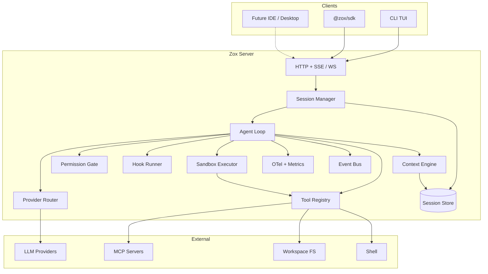

# Zox architecture (v0.2)

## Goals

1. **Harness, not a chat wrapper** — session loop, tools, permissions, recovery, and context policy as first-class concepts.
2. **BYOK** — users supply keys for OpenRouter, Groq, Anthropic, OpenAI, Gemini (and OpenAI-compatible endpoints).
3. **Effective context** — predictable token accounting, overflow handling, compaction, optional pruning.
4. **Extensibility** — MCP servers, user skills, slash commands, custom agents/tools via stable extension points.
5. **Option C delivery** — **TUI + `zox serve` + `@zox/sdk`** developed against the same server contract from day one.
6. **Plan–act–observe–recover** — explicit plan state, sandboxed execution, observation budgets, hooks + compaction for recovery ([capstone](https://aiengineeringfromscratch.com/lesson?path=phases/19-capstone-projects/01-terminal-native-coding-agent)).

## Non-goals (initial releases)

- Hosted multi-tenant cloud (local-first; optional remote server is user-operated).
- Full LSP fleet parity with OpenCode in MVP (planned V2).
- Storing or training on user code (privacy-first default).

## High-level diagram



## Repository layout (monorepo)

**Bun workspaces** at the repo root (`package.json` → `"workspaces": ["packages/*"]`). CI and local dev use `bun install` / `bun run` / `bun test` only.

```
zox/
  package.json       # workspaces, scripts, catalog deps
  bun.lock
  packages/
    contracts/     # Shared types, OpenAPI-generated types, event schemas (Zod)
    core/          # Agent loop, agents, permissions, compaction orchestration
    context/       # Token estimation, assembly, prune/compaction helpers
    providers/     # Provider adapters + model catalog glue
    tools/         # Built-in tools + registry
    sandbox/       # Path jail, denylist, subprocess runner, tier adapters
    hooks/         # Lifecycle hook runner (command/http)
    observability/ # OpenTelemetry, Prometheus, budgets
    memory/        # Plan persistence, durable memory, prior-state
    mcp/           # MCP client pool, OAuth hooks, tool namespacing
    skills/        # Skill discovery, SKILL.md loader, injection rules
    session/       # Persistence (SQLite), snapshots (later)
    server/        # Hono HTTP server, SSE, WebSocket, OpenAPI
    cli/           # `zox` bin: REPL hooks, TUI, slash commands UI
    sdk/           # `@zox/sdk` typed client
    tui/           # Terminal UI components (optional split from cli)
  spec/            # This folder
```

**Package dependency rule:** `cli` and `sdk` depend on `contracts` + HTTP only at runtime; they do not import `core` internals directly. Integration tests may import `server` in-process.

**Publishing:** `zox` and `@zox/*` are built with `bun build` / `tsc` as needed and released with **`bun publish`** to the npm registry. Consumers install/run with **`bunx zox`** (or any npm-compatible client). Develop, test, and ship entirely on Bun.

## Core subsystems

### 1. Session manager

- Creates/resumes sessions scoped to a **workspace root** (and optional git root).
- Owns message graph: user, assistant, tool calls, tool results, system, compaction summaries.
- Exposes **session status**: `idle`, `running`, `compacting`, `awaiting_permission`, `error`.
- Supports **cancellation** and **revert** (file snapshots in later phase).

### 2. Agent loop

Single orchestrator used by all clients:

```
while session not done:
  if compaction queued or overflow → run compaction pass → continue
  assemble context (context engine)
  select agent (build | plan | custom) → permissions + tools + system prompt
  stream model turn
  if tool calls → permission gate → PreToolUse hooks → sandbox → execute → PostToolUse → observe (truncate) → continue
  else → Stop hooks → finish turn
```

Agents are **named profiles**: model defaults, temperature, tool allowlist, permission ruleset, prompt template id.

### 3. Context engine

See [context.md](./context.md). Responsibilities:

- Layer instructions: global config → project file → agent prompt → session overrides.
- Attach referenced files and recent tool results subject to policy.
- Estimate tokens (provider-reported when available; heuristic fallback).
- Trigger **auto-compaction** and honor **manual compact** (slash/SDK).

### 4. Permission gate and verification

- Evaluates each tool invocation against agent ruleset: `allow`, `deny`, `ask`.
- **Verification gate** — turn limits, observation budget, rate limits (see [observability.md](./observability.md)).
- Client surfaces **approval UI** (TUI modal; SDK callback / long-poll or WS event).
- Default agents:
  - **build** — read/write/shell/MCP per config; ask on destructive shell patterns (configurable).
  - **plan** — read-only tools; no write/shell/MCP write paths.

See [sandbox.md](./sandbox.md) for execution isolation after approval.

### 4b. Hook runner

See [hooks.md](./hooks.md). Runs lifecycle hooks (MVP: eight events) with matchers; `PreToolUse` / `PreCompact` / `Stop` can block or reshape input.

### 4c. Sandbox executor

See [sandbox.md](./sandbox.md). Tiers `host` → `worktree` → `container` → `remote`; path jail and subprocess denylist on all tiers.

### 4d. Memory subsystem

See [memory.md](./memory.md). Plan (`todowrite`), prior-state blocks, durable `.zox/memory`, episodic SQLite.

### 5. Provider router

See [providers.md](./providers.md). Unified interface:

- `complete` / `stream` with tool schemas
- Usage: `inputTokens`, `outputTokens`, `cacheRead`, `cacheWrite`, `estimatedCost` (optional)
- Model id format: `provider/model` (e.g. `anthropic/claude-sonnet-4`, `openrouter/...`)

### 6. Tool registry

See [tools-extensibility.md](./tools-extensibility.md). Built-ins registered at server start; MCP and plugins merge in with namespacing `mcp_<server>_<tool>`.

### 7. Event bus

Typed events (Zod) for UI and SDK:

- `session.status`, `message.delta`, `message.completed`
- `tool.started`, `tool.completed`, `tool.permission_required`
- `usage.turn`, `usage.session`
- `context.overflow`, `context.compacted`
- `error`

Delivery: in-process for embedded server; SSE (+ optional WS) for remote clients.

### 8. Session store

- **SQLite** (default): messages, sessions, config snapshots, usage aggregates.
- Migrations via embedded version table.
- Future: object storage for large tool payloads (optional offload).

## Server API (contract-first)

- **OpenAPI 3.1** published from `packages/server`.
- REST for session CRUD, config, model list, MCP management.
- **SSE** `GET /sessions/{id}/events` for streaming.
- **WebSocket** (optional v1.1) for bidirectional permission responses and lower latency deltas.

Authentication for `zox serve`:

- Local bind `127.0.0.1` default; token in `ZOXX_SERVER_TOKEN` or generated on first start.
- Clients pass `Authorization: Bearer <token>`.

## Configuration

Resolution order (later overrides earlier):

1. Defaults in code
2. `~/.config/zox/config.json` (or `ZOXX_CONFIG_PATH`)
3. Project `.zox/config.json`
4. Environment variables (`ZOXX_*`, provider-specific `ANTHROPIC_API_KEY`, etc.)
5. CLI flags / SDK session options

Sensitive fields: store **references** (`"apiKeyEnv": "OPENROUTER_API_KEY"`) not raw keys in project config.

## Security posture

- Default tier **`worktree`**: edits in an isolated git worktree; **path jail + denylist** on all tiers (not a kernel sandbox). `host` mode opt-in.
- Tiers `container` / `remote` for autonomous `agent run` style tasks (capstone).
- MCP servers are user-declared; show trust warning on first connect.
- Project hooks require explicit trust (`zox hooks trust`).
- Redact secrets in logs, traces (unless opted in), and exported sessions.
- CORS: allowlist local dev origins only by default.

## Testing strategy

| Layer | Approach |
|-------|----------|
| `core`, `context`, `providers` | Unit tests with mocked providers |
| `server` | HTTP contract tests against OpenAPI |
| `cli` / `tui` | Snapshot tests for slash parser; smoke e2e with fake provider |
| `sdk` | Contract tests against running test server |

## Observability

See [observability.md](./observability.md): OpenTelemetry GenAI spans, OTLP export (Langfuse-compatible), Prometheus `/metrics`, structured logs with trace correlation.

## Related documents

- [clients.md](./clients.md) — parallel TUI + SDK against server
- [sandbox.md](./sandbox.md), [hooks.md](./hooks.md), [memory.md](./memory.md)
- [phases.md](./phases.md) — what ships when
