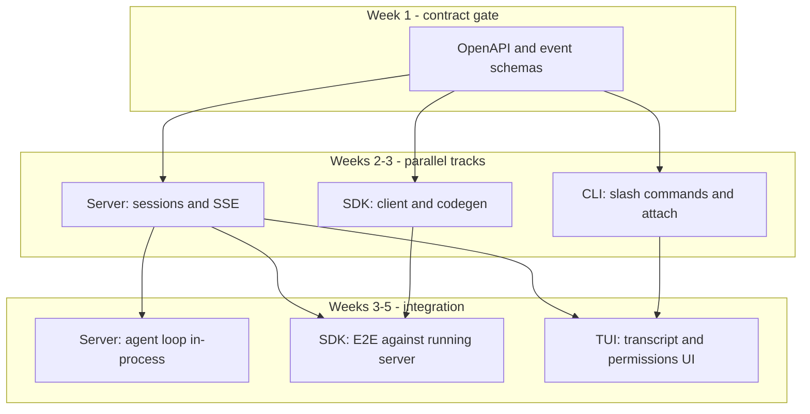

# Clients: TUI + server + SDK (option C)

## Principle

All interactive and programmatic clients talk to the **same Zox Server API**. No duplicate agent loops in the TUI. The CLI may embed the server in-process for local dev (`zox` default) or attach to `zox serve` (`zox attach` / `--url`).

## Modes of operation

| Mode | Command | Use case |
|------|---------|----------|
| **Embedded** | `zox` | Single process: server on loopback + TUI; simplest install |
| **Headless** | `zox serve` | CI, remote machine, IDE extension |
| **Attached** | `zox --url http://host:port` | TUI as remote client |
| **Programmatic** | `@zox/sdk` | Scripts, automation, custom UIs |

Embedded and headless must behave identically aside from networking.

## CLI (`packages/cli`)

### Responsibilities

- Parse global flags: `--model`, `--agent`, `--workspace`, `--url`, `--token`, `--no-tui`.
- Start or connect to server.
- Run **TUI** or fallback **plain REPL** when `stdout` is not a TTY.
- Render streaming output, tool cards, permission prompts.
- Dispatch **slash commands** (see [tools-extensibility.md](./tools-extensibility.md)).

### TUI (`packages/tui` or subfolder)

Recommended stack: **Ink 5** on Bun (capstone-aligned); evaluate OpenTUI if needed. Requirements:

- Scrollable transcript with tool result folding.
- Status bar: model, agent, cwd, **session token usage**.
- Input: multiline, history, slash completion.
- Non-blocking permission dialogs.

### CLI without TTY

- Line-oriented REPL; no slash completion UI but commands still work.
- Permission prompts: `y/n` on stdin or fail with `permission denied` if non-interactive (SDK sets `autoApprove` policy explicitly).

## Server (`packages/server`)

### Endpoints (minimum viable)

| Method | Path | Description |
|--------|------|-------------|
| POST | `/sessions` | Create session |
| GET | `/sessions/{id}` | Session metadata + status |
| POST | `/sessions/{id}/messages` | Send user message (starts turn) |
| POST | `/sessions/{id}/cancel` | Cancel in-flight turn |
| GET | `/sessions/{id}/events` | SSE stream |
| POST | `/sessions/{id}/permissions/{requestId}` | Approve/deny tool |
| GET | `/models` | List configured models |
| GET | `/usage` | Session or global usage summary |
| GET/PUT | `/config` | Effective config (redacted) |
| POST | `/mcp/servers` | Register MCP server |
| DELETE | `/mcp/servers/{name}` | Remove MCP server |

OpenAPI is the contract both `sdk` and third-party clients use.

## SDK (`@zox/sdk`)

### API shape (illustrative)

```ts
import { createZoxClient } from "@zox/sdk";

const client = createZoxClient({ baseUrl, token });

const session = await client.sessions.create({ workspaceRoot, agent: "build" });

const run = session.send("Refactor auth module");

for await (const event of run.events()) {
  if (event.type === "message.delta") process.stdout.write(event.delta);
  if (event.type === "tool.permission_required") {
    await run.respondPermission(event.requestId, { approved: true });
  }
}

const usage = await session.getUsage();
```

### SDK requirements

- Generated types from OpenAPI (optional `openapi-typescript`).
- SSE parser with reconnect + `Last-Event-ID` (v1.1).
- Helpers: `waitForIdle()`, `collectText()`, `onTool()`.
- **Bun-first** runtime for CLI, server, and SDK; avoid Node-only APIs in shared code (Node compatibility optional later for `@zox/sdk` consumers).

## Parallel development (option C)

Workstreams share **contracts first**:



Timeline (same plan; safe in plain Markdown tables):

| Track | After contract | After server MVP |
|-------|----------------|------------------|
| Server | Sessions + SSE (2w) | Agent loop (2w) |
| SDK | Client + codegen (10d) | E2E tests (2w) |
| CLI/TUI | Slash + attach (1w) | TUI transcript (3w) |

**Integration gate:** weekly demo script — SDK sends message, TUI shows same session via attach, usage matches.

## Future clients

- VS Code extension: uses `@zox/sdk` + language client patterns.
- Desktop: wraps server + embedded webview or TUI.
