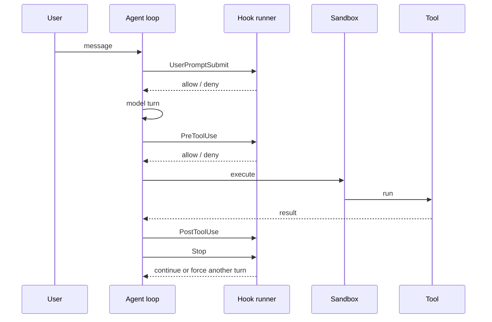

# Lifecycle hooks

Hooks let users and projects inject policy, automation, and **memory reinjection** without forking the harness. Zox aligns with the [capstone hook requirements](https://aiengineeringfromscratch.com/lesson?path=phases/19-capstone-projects/01-terminal-native-coding-agent).

**Format:** **Zox-only** — a single schema in `.zox/hooks.json` (and optional `~/.config/zox/hooks.json`). We do not import or translate `.claude/settings.json` hooks; third-party docs may use similar event names, but the JSON shape and semantics are defined here.

## Design goals

- **Prevention before execution** — `PreToolUse` and gates block damage (e.g. `rm -rf` outside worktree).
- **Observation after execution** — `PostToolUse` for formatters, token accounting, audit logs (cannot undo the call).
- **Recovery on context pressure** — `PreCompact` / `SessionStart(compact)` preserve plan and prior state.
- **Deterministic ordering** — hooks run in declared order; failures are explicit.

## MVP hook events (capstone “eight”)

These eight cover the agent loop end-to-end; additional events are added in [Extended events](#extended-events-v15).

| Event | When | Can block? | Typical use |
|-------|------|------------|-------------|
| `SessionStart` | Session create/resume | Inject only* | Load memories, env, matchers: `startup`, `resume`, `compact` |
| `UserPromptSubmit` | User message accepted | Yes | PII scrub, prompt expand, slash preprocess |
| `PreToolUse` | Before tool executes | Yes | Destructive command guard, network block |
| `PostToolUse` | After tool success | No** | Auto-format, usage accounting, span attrs |
| `PreCompact` | Before compaction | Yes | Backup transcript; custom summarizer trigger |
| `PostCompact` | After compaction | No | Metrics; prefer `SessionStart`+`compact` for reinjection |
| `Stop` | Model wants to end turn | Yes | “Not done until tests pass” |
| `SessionEnd` | Session closes | No | **Auto-summarize memory**, optional worktree cleanup |

\*Blocking `SessionStart` is not supported; hooks may only **append** context or set session metadata.  
\*\*`PostToolUse` cannot prevent the tool from having run; use `PreToolUse` to block.

### Capstone-required user hooks (reference implementations)

Ship as **examples** in `examples/hooks/`:

1. **PreToolUse** — destructive-command guard (`rm -rf`, paths outside `sandbox.root`).
2. **PostToolUse** — token / observation accounting (feed usage + truncated byte counts).
3. **PreCompact** — at ~150k tokens, summarize older turns into a **prior-state block** (plan + open files) before default compaction.
4. **SessionStart** matcher `compact` — re-inject prior-state summary after compaction (preferred over `PostCompact` for context).

## Handler types

| Type | MVP | Description |
|------|-----|-------------|
| `command` | Yes | Shell command, JSON stdin, stdout JSON response |
| `http` | Phase 1.5 | POST hook payload to URL |
| `plugin` | V2 | JS module in `.zox/hooks/*.ts` |

### Command hook contract

**Input (stdin):** JSON `HookInput` with `event`, `session`, `tool?`, `prompt?`, `context` stats.

**Output (stdout):** JSON `HookOutput`:

```json
{
  "decision": "allow" | "deny" | "ask",
  "reason": "optional human message",
  "message": "optional text injected for the model",
  "updatedInput": { }
}
```

**Exit codes (command hooks):**

| Code | Meaning |
|------|---------|
| 0 | Success; read stdout JSON |
| 2 | Block (equivalent to `decision: deny`) for block-capable events |
| Other | Hook failed; default `warn` and continue (configurable `hooks.onError`) |

## Configuration

Search order:

1. `.zox/hooks.json` (project)
2. `~/.config/zox/hooks.json` (user)

```json
{
  "zoxHooksVersion": 1,
  "hooks": {
    "PreToolUse": [
      {
        "matcher": "bash|write|edit",
        "type": "command",
        "command": ".zox/hooks/guard-destructive.sh",
        "timeoutMs": 5000
      }
    ],
    "PostToolUse": [
      {
        "matcher": "*",
        "type": "command",
        "command": ".zox/hooks/account-tokens.sh"
      }
    ],
    "PreCompact": [
      {
        "matcher": "auto|manual",
        "type": "command",
        "command": ".zox/hooks/prior-state-summary.sh"
      }
    ],
    "SessionStart": [
      {
        "matcher": "compact",
        "type": "command",
        "command": ".zox/hooks/reinject-after-compact.sh"
      }
    ]
  }
}
```

**Matchers:** regex on tool name (`bash`, `mcp__.*`), compaction trigger (`manual`, `auto`), or `SessionStart` source (`startup`, `resume`, `compact`).

## Integration points in the loop



Compaction path:

1. `PreCompact` (optional custom summary / backup).
2. Context engine compaction (or hook-only prior-state path).
3. `PostCompact` (telemetry).
4. `SessionStart` with matcher `compact` → reinject critical state into context.

## Extended events (v1.5+)

Additional Zox lifecycle events (same config file, `zoxHooksVersion` bump when shapes change):

- `PermissionRequest`, `PermissionDenied`
- `PostToolUseFailure`, `PostToolBatch`
- `UserPromptExpansion` (slash → prompt)
- `SubagentStart`, `SubagentStop`
- `InstructionsLoaded` (audit `AGENTS.md` / skills loaded — see [skills.md](./skills.md))

No compatibility layer for other products’ hook config files — only Zox `hooks.json`.

## Security

- Hooks run as the **same OS user** as the server — treat hook commands as trusted code.
- Project hooks require one-time trust: `zox hooks trust` records project path hash.
- Hook stdout must not include secrets; server redacts known env patterns in debug logs.

## SDK / server API

- `GET /hooks` — effective hook config (commands redacted to paths only).
- `POST /sessions/{id}/hooks/test` — dry-run event with fixture payload (dev only).

## Related

- [sandbox.md](./sandbox.md) — executor after hooks allow
- [memory.md](./memory.md) — prior-state blocks and cross-session memory
- [observability.md](./observability.md) — span attributes from hook duration
