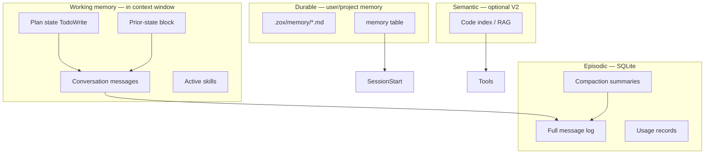

# Memory model

“Memory” in Zox is split intentionally — the capstone’s **plan state**, **conversation context**, **compaction recovery**, and optional **cross-session** recall are different mechanisms. Conflating them causes stale plans and silent context loss.

## Four memory layers



| Layer | What | Lifetime | Survives compaction? |
|-------|------|----------|----------------------|
| **Plan** | `todowrite` full state (rewrite each turn) | Session | Yes — protected in summaries |
| **Working** | Messages sent to the model this turn | Turn | Partial — old turns summarized |
| **Prior-state block** | Hook/compaction artifact: plan + files + decisions | Session | Yes — reinjected after compact |
| **Episodic** | SQLite archive | Persistent | N/A (audit) |
| **Durable** | Explicit user/project memories | Cross-session | Loaded on `SessionStart` |
| **Semantic** | Embeddings over repo/docs | Project | Retrieved per turn via tools |

## Plan memory (capstone pattern)

- Schema: items with `id`, `content`, `status` (`pending` | `in_progress` | `done`), `notes`.
- Model must call `todowrite` with the **full list** each update — no incremental patch API (reduces drift).
- Persisted in `sessions.plan_json` and included in:
  - compaction summarizer input
  - `PreCompact` / prior-state hook output
  - protected from [prune](./context.md) of tool bodies

## Working memory and observation budget

From **verification gates / observation budget** (curriculum):

- Tool stdout in context capped by `sandbox.maxToolOutputChars`.
- Ripgrep/glob: default limits on match count and bytes (teach the “8MB ripgrep” failure mode).
- `PostToolUse` hooks may further trim or attach digests.

Compaction triggers when estimated tokens exceed threshold; see [context.md](./context.md).

## Prior-state block (recovery)

When context approaches budget (capstone: **150k** soft mark via `budget.preCompactTokenThreshold`):

1. **`PreCompact` hook** may run a **small model** summarization into a structured block:

```markdown
## Prior state (auto)
- Goal: ...
- Plan: [todo ids and in_progress item]
- Files touched: ...
- Decisions: ...
- Open questions: ...
```

2. Default compaction may still run afterward.
3. **`SessionStart` hook** with matcher `compact` injects the block as session context (Claude Code–recommended pattern vs relying on `PostCompact` alone).

Stored in `sessions.prior_state_markdown` and referenced in context assembly until next compaction.

## Durable memory (cross-session)

**Default: auto-summarize** when a session ends. Users can still add facts explicitly; auto summaries are clearly labeled and searchable.

### Auto-summarize (`SessionEnd`)

When `memory.autoSummarize` is `true` (default):

1. After the last turn (or `/exit` / SDK `session.close()`), run a **memory agent** (small/fast model from config `memory.summarizeModel`).
2. Input: final `plan_json`, prior-state block if any, compaction summaries, and the last *N* turns (truncated per observation rules).
3. Output: structured markdown appended under:

```text
.zox/memory/auto/
  YYYY-MM-DD_<sessionId>.md
  index.json          # metadata: workspace, branch, tokens, trace_id
```

4. Optionally merge bullet facts into `.zox/memory/rolling-summary.md` (dedupe by semantic hash or LLM merge step).

```json
{
  "memory": {
    "autoSummarize": true,
    "summarizeModel": "openrouter/anthropic/claude-haiku-4",
    "startupInjectCount": 5,
    "rollingSummary": true,
    "autoInject": ["preferences.md"]
  }
}
```

Disable: `"autoSummarize": false` or `ZOXX_MEMORY_AUTO_SUMMARIZE=0`.

Auto summaries are **not** full transcript archives — episodic SQLite retains the full log. Summaries capture goals, decisions, files touched, and follow-ups.

### Write paths

| Mechanism | Scope |
|-----------|--------|
| **SessionEnd auto-summarize** | Project `.zox/memory/auto/` (default on) |
| `memory_write` tool (V1.5) | User-approved facts |
| `/remember <text>` slash | Interactive pin (high priority in search) |
| `PostToolUse` / `SessionEnd` hooks | Project automation |
| Manual edit | `.zox/memory/*.md` |

### Read paths

| Mechanism | When |
|-----------|------|
| `memory_search` tool | Model retrieves snippets (FTS; pins rank higher) |
| `SessionStart` matcher `startup` | Inject top-k from auto + manual memories |
| Config `memory.autoInject[]` | Always include named files (e.g. `preferences.md`) |

### Storage

```text
.zox/memory/
  auto/                 # session-end summaries (generated)
  rolling-summary.md    # optional merged digest
  preferences.md        # user-edited
  project-facts.md
```

SQLite table `memories(id, scope, tags, content, embedding?, updated_at)` for search (FTS5 in MVP; vectors optional V2).

**Scopes:** `project`, `user` (`~/.config/zox/memory/`), `session` (ephemeral promotion).

### Privacy

- `zox export session` excludes durable memory unless `--include-memory`.
- Auto-summarize runs **locally** through the user’s configured provider (BYOK); no Zox cloud.
- Memories never sent to providers without being in assembled context (user-visible in `/context`).
- Add `.zox/memory/auto/` to `.gitignore` by default in `zox init`; user may commit if they want team-shared agent memory.

## Semantic memory (V2 — RAG)

Capstone lesson 2 in the same phase: **RAG over codebase**. Zox defers embeddings index to V2:

- Hybrid BM25 + dense (BYOK embedding provider).
- Invoked via `code_search` tool, not stuffed into system prompt.
- Keeps MVP memory model simple.

## Session resume

On resume:

- Reload episodic messages; rebuild provider context per compaction markers.
- Reload `plan_json` and `prior_state_markdown`.
- Fire `SessionStart` matcher `resume` hooks.
- Reattach sandbox root (worktree path if tier 1+).

## Anti-patterns

| Problem | Mitigation |
|---------|------------|
| Stale plan after resume | Always load `plan_json`; show plan pane in TUI |
| Lost goals after compact | Prior-state block + `SessionStart(compact)` |
| Context poisoning from huge tool output | Sandbox truncation + observation budget |
| Silent long-term PII | Auto summaries are labeled and disable-able; `/remember` for sensitive pins user controls |

## API

- `GET /sessions/{id}/memory` — plan + prior-state + injected durable ids
- `POST /sessions/{id}/memory` — append durable entry (SDK)
- `GET /memory/search?q=` — FTS search (project scope)

## Related

- [hooks.md](./hooks.md) — PreCompact, SessionStart(compact)
- [observability.md](./observability.md) — compaction and token metrics
- [context.md](./context.md) — assembly order
