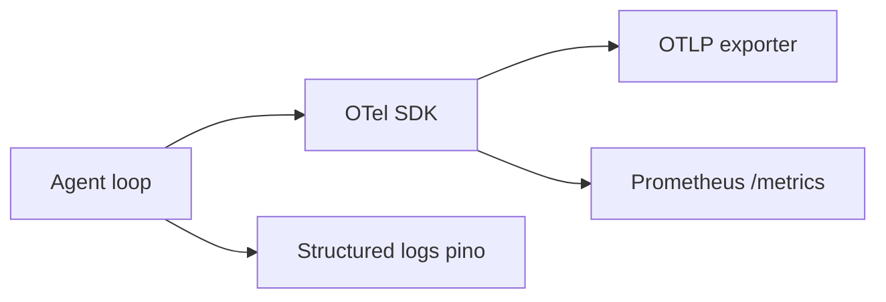

# Observability (OpenTelemetry + metrics)

Zox treats observability as a first-class harness concern — same priority as the capstone stack: **OpenTelemetry with GenAI semantic conventions**, export to OTLP (e.g. Langfuse, Jaeger), plus **Prometheus** metrics for local ops.

## Goals

- Debug agent loops (which tool blew the budget on turn 47?).
- Compare runs: pass@1, turns-per-task, **$/task** (capstone eval).
- Correlate **hooks**, **sandbox denials**, and **model usage** in one trace.
- Default **privacy-safe**: no full prompts in spans unless `observability.recordContent=true`.

## Architecture



Package: `packages/observability` — initialized once per server process.

## Traces (GenAI semconv)

Follow [OpenTelemetry GenAI semantic conventions](https://opentelemetry.io/docs/specs/semconv/gen-ai/) (stable attributes as implemented by OTel JS SDK).

### Span hierarchy

```
session (zox.session)
└── turn (gen_ai.chat)
    ├── model.call (gen_ai.chat)     # each LLM request in the tool loop
    │   └── attributes: gen_ai.request.model, gen_ai.usage.*
    ├── tool.execute (gen_ai.tool) # per tool invocation
    │   └── sandbox.*, tool.denied, duration
    ├── compaction (zox.compaction)
    └── hook (zox.hook)            # per hook invocation
```

### Key attributes

| Attribute | Source |
|-----------|--------|
| `gen_ai.operation.name` | `chat`, `generate_content`, `execute_tool` |
| `gen_ai.request.model` | provider/model id |
| `gen_ai.usage.input_tokens` | provider usage |
| `gen_ai.usage.output_tokens` | provider usage |
| `gen_ai.response.finish_reasons` | stop, tool_calls, length |
| `zox.session.id` | session UUID |
| `zox.turn.index` | monotonic turn counter |
| `zox.agent.name` | build / plan / custom |
| `zox.sandbox.mode` | worktree (default) / host / container / remote |
| `zox.tool.denied` | sandbox or PreToolUse |
| `zox.hook.event` | PreToolUse, etc. |

Content recording (opt-in):

- `gen_ai.prompt` / `gen_ai.completion` — truncated hashes by default (`observability.content.maxChars`).

## Metrics (Prometheus)

Expose `GET /metrics` on the server (bind localhost only unless `observability.metrics.public=true`).

| Metric | Type | Description |
|--------|------|-------------|
| `zox_turns_total` | counter | Completed turns |
| `zox_tool_calls_total` | counter | By `tool_name`, `denied` |
| `zox_tokens_total` | counter | By `provider`, `direction=input|output` |
| `zox_turn_duration_seconds` | histogram | End-to-end turn |
| `zox_model_latency_seconds` | histogram | Per model call |
| `zox_context_estimated_tokens` | gauge | Last pre-request estimate |
| `zox_compactions_total` | counter | auto vs manual |
| `zox_session_cost_usd` | gauge | Estimated spend (if catalog has pricing) |
| `zox_hook_duration_seconds` | histogram | By `event` |

Capstone **cost control** maps to metrics + hard limits:

- `budget.maxTurns` (default unset; capstone suggests 50 for `agent run`)
- `budget.maxContextTokens` (200k)
- `budget.maxUsdPerTask` (5)

Breaches emit `budget.exceeded` event and cancel the turn (hookable).

## Logs

Structured JSON (pino) with trace correlation:

- `trace_id`, `span_id` injected from active OTel context.
- Fields: `sessionId`, `turnId`, `tool`, `durationMs`, `denied`, `truncated`.
- Never log API keys; redact `Authorization` headers.

## Configuration

```json
{
  "observability": {
    "enabled": true,
    "serviceName": "zox",
    "otlp": {
      "endpoint": "http://localhost:4318/v1/traces",
      "headers": { "Authorization": "Bearer ${LANGFUSE_OTEL_TOKEN}" }
    },
    "metrics": { "enabled": true, "port": 9464 },
    "recordContent": false,
    "contentMaxChars": 2000,
    "sampleRate": 1.0
  },
  "budget": {
    "maxTurns": null,
    "maxContextTokens": null,
    "maxUsdPerTask": null,
    "preCompactTokenThreshold": 150000
  }
}
```

Environment shortcuts:

- `OTEL_EXPORTER_OTLP_ENDPOINT`
- `OTEL_SERVICE_NAME=zox`
- `ZOXX_OBSERVABILITY=0` disables OTel (logs only)

## Client visibility

- TUI footer: last turn tokens + session cost estimate.
- `/trace` — print last turn `trace_id` for lookup in Langfuse.
- SDK: `session.getTraceUrl()` when exporter provides deep link template.

## Eval harness integration (phase 2)

Capstone compares harnesses on **pass@1**, **turns-per-task**, **$/task**:

- Export run summary JSON from metrics + SQLite usage tables.
- Fixture tasks in `eval/tasks/*.yaml` consumed by `zox eval run`.

## Testing

- In-memory OTel exporter in vitest; assert span names and token attributes on fake provider.
- Snapshot Prometheus text format for one synthetic turn.

## Related

- [context.md](./context.md) — observation budget and truncation
- [hooks.md](./hooks.md) — hook spans
- [sandbox.md](./sandbox.md) — denial attributes on tool spans
