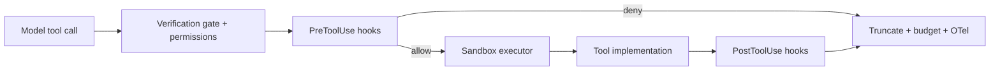

# Tool sandboxing and execution safety

Zox separates **whether** a tool may run from **how** it runs. This matches the [Terminal-Native Coding Agent capstone](https://aiengineeringfromscratch.com/lesson?path=phases/19-capstone-projects/01-terminal-native-coding-agent) and the curriculum’s **verification gates** + **sandbox runner** lessons.

## Two layers



| Layer | Question | Can block execution? |
|-------|----------|----------------------|
| **Permission gate** | Does this agent/profile allow this tool? | Yes (ask/deny) |
| **Verification gate** | Does this call pass policy (budget, shape, rate)? | Yes |
| **PreToolUse hooks** | User/project policy (destructive shell, network) | Yes |
| **Sandbox executor** | Safe argv/path/env for subprocess & FS | Yes (refuse before spawn) |
| **PostToolUse** | Format, lint, accounting | No (already ran) |

The sandbox is a **development guardrail**, not a kernel security boundary. Production autonomy should use stronger isolation (container / microVM).

## Sandbox modes (tiers)

Configurable per session via `sandbox.mode` or `zox run --sandbox <tier>`.

| Tier | Name | Use case | Isolation |
|------|------|----------|-----------|
| **0** | `host` | Power users; edit checkout in place | Path jail + denylist on subprocess tools |
| **1** | `worktree` | **Default for `zox`** | Git worktree under `.zox/worktrees/<sessionId>` as jail root |
| **2** | `container` | CI / untrusted tasks | Docker/Podman: project mount RW, no host `$HOME` secrets |
| **3** | `remote` | Capstone-style autonomy | E2B / Daytona / devcontainer; host FS unreachable |

**Default:** `sandbox.mode = "worktree"`. The main working tree stays clean until the user merges or cherry-picks from the session worktree.

Capstone expectation: **tier 3** for `agent run <repo> "<task>"` style jobs; **tier 1** for normal interactive `zox`.

### Worktree lifecycle (default)

On `SessionStart` matcher `startup` when mode is `worktree`:

1. Require a git repo (or fall back to `host` with a one-time warning if `sandbox.worktree.requireGit=false`).
2. `git worktree add -b zox/<sessionId> .zox/worktrees/<sessionId>` (branch name configurable).
3. Set `sandbox.root` to the worktree path; all FS/bash tools operate there.

On `SessionEnd`:

- Default `sandbox.worktree.cleanup = "keep"` — worktree and branch remain for review.
- Optional `cleanup = "remove"` — `git worktree remove` + delete branch (after user confirms or `--force`).

CLI: `zox --sandbox host` bypasses worktree for that session.

## Sandbox executor (`packages/sandbox`)

Applies to `bash`, `grep` (when subprocess), MCP tools that spawn processes, and any tool that touches paths.

### Refusal axes (before subprocess)

1. **Executable denylist** — basenames: `sudo`, `rm`, `mkfs`, `dd`, `chmod` (configurable `sandbox.denylist.executables[]`).
2. **Argv inspector** — block interpreter smuggling: `python -c`, `node -e`, `bash -c`, `perl -e`, etc. (`sandbox.denylist.interpreterFlags`).
3. **Shell metacharacters** — when `shell=false` (default), refuse `; | & > < \` $()`.
4. **Path jail** — every path-like argument resolved with `realpath`; must stay under `sandbox.root` (workspace or worktree). Symlink escapes blocked via `realpath`, not literal prefix.

### Execution limits

| Setting | Default | Purpose |
|---------|---------|---------|
| `sandbox.timeoutMs` | 120_000 | Wall-clock kill |
| `sandbox.maxOutputBytes` | 256_000 | Cap stdout/stderr (capstone: avoid 8MB ripgrep dumps) |
| `sandbox.maxToolOutputChars` | 32_000 | What enters the **model context** after observe step |
| `sandbox.envAllowlist` | optional | Strip env to known-safe set in tier 2+ |

### Structured result

All sandboxed tools return a normalized envelope (for eval + OTel):

```ts
interface ToolExecutionResult {
  ok: boolean;
  exitCode: number;
  stdout: string;
  stderr: string;
  truncated: boolean;
  timedOut: boolean;
  denied: boolean;
  denyReason?: string;
  durationMs: number;
}
```

Sentinel `exitCode` values when nothing ran: `denied = -100`, `timedOut = -101` (curriculum convention).

## Filesystem tools (`read`, `write`, `edit`)

On **all tiers**, FS tools go through the same **path jail** (no reads/writes outside `sandbox.root`). On `worktree`, `sandbox.root` is the worktree directory, not the parent repo root unless explicitly opened via `host` mode. `webfetch` is not path-jailed but is subject to **network policy** (hooks + config).

## Network policy

| Tier | Default `webfetch` / curl in bash |
|------|-----------------------------------|
| 0–1 | `ask` or allowlist domains |
| 2–3 | deny by default; allowlist only |

Capstone exercise: block `curl` exfiltration via **PreToolUse** + tier 3 having no egress.

## Git worktree isolation (tier 1+)

On session or task start:

```bash
git worktree add -b zox/<sessionId> .zox/worktrees/<sessionId>
```

- `sandbox.root` = worktree path.
- On success/failure/cancel: optional `worktree remove` + branch delete (config `sandbox.worktree.cleanup`).

## Composition with permissions

Order of evaluation:

1. Agent ruleset (`plan` denies `write`/`bash`).
2. Verification gate (turn budget, observation budget).
3. `PreToolUse` hooks.
4. User permission prompt (if `ask`).
5. Sandbox checks at execution.
6. Tool runs.
7. `PostToolUse` hooks → truncate → append to context.

## Config example

```json
{
  "sandbox": {
    "mode": "worktree",
    "worktree": {
      "path": ".zox/worktrees",
      "branchPrefix": "zox/",
      "cleanup": "keep",
      "requireGit": true
    },
    "root": ".",
    "timeoutMs": 120000,
    "maxOutputBytes": 262144,
    "maxToolOutputChars": 32000,
    "denylist": {
      "executables": ["sudo", "rm", "mkfs"],
      "blockInterpreterOneLiners": true
    },
    "network": { "default": "ask", "allowHosts": ["api.github.com"] }
  }
}
```

## Testing

- Fixture adversarial argv/path cases (from capstone stress tests).
- Property: no path under jail root can escape via `../` or symlink.
- Golden tests for truncation markers in stdout.

## References

- [Capstone 01 — Terminal-Native Coding Agent](https://aiengineeringfromscratch.com/lesson?path=phases/19-capstone-projects/01-terminal-native-coding-agent) — E2B/worktree, sandbox wrapping.
- Curriculum: *Sandbox Runner with Denylist and Path Jail* — denylist, argv, path jail, timeout, truncation.
